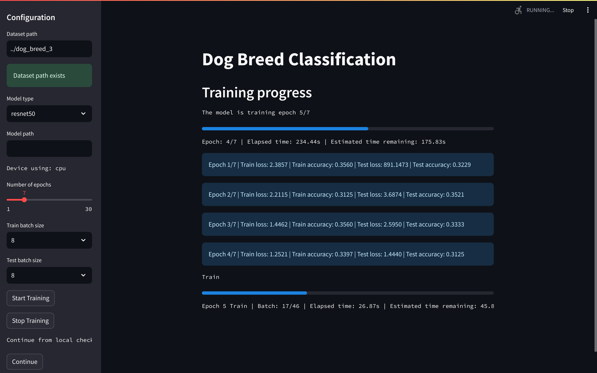
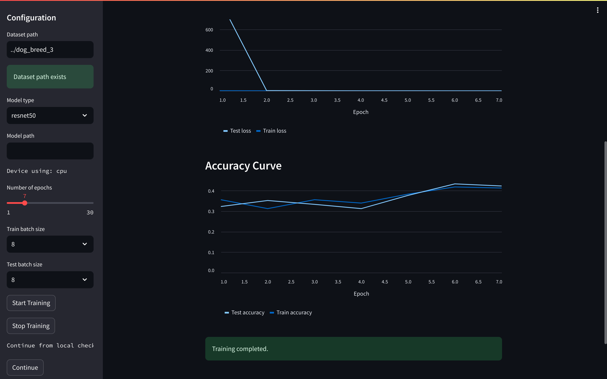

# Dog Breed Classification

A `streamlit` WebApp and `program` that can load a dog breed dataset, applying transfer learning techniques that allow users to load their pretrained model to train a convolutional neural network to classify dog breeds. 

Coming soon: classify dog breeds from user-supplied images.

## Project Requirements

1. Write a python program using pytorch to classify dog breeds with requirements a, b, c: `./program`
2. Apply a technique to reduce 80% resnet50 parameter size in 2c, preserving the performance: `./notebook`

UI for the model using Streamlit: `./streamlit`

## Table of Contents
- [Dog Breed Classification](#dog-breed-classification)
  - [Project Requirements](#project-requirements)
  - [Table of Contents](#table-of-contents)
  - [Dataset](#dataset)
  - [Installation](#installation)
  - [Usage](#usage)
  - [Demo:](#demo)

## Dataset

The dataset is taken from this [Kaggle's Stanford Dogs Dataset](https://www.kaggle.com/datasets/jessicali9530/stanford-dogs-dataset).

Consisiting of 120 classes of dog breeds, the original dataset is split into 2 folders: train and validation. Each folder contains 120 subfolders, each corresponding to a different dog breed. Each subfolder contains 100-150 images of that specific dog breed.

To make it easier to test, I made three subsets from the original dataset:
- `dog_breed_3`: 3 classes of dog breeds.
- `dog_breed_10`: 10 classes of dog breeds.
- `dog_breed_120`: 120 classes of dog breeds, the full dataset.

## Installation

1. Clone this repository to your local machine.
2. The `python_code` folder is for the python program only, he `streamlit` folder is for the streamlit app. Read `README.md` in those for more information.
3. Install the required dependencies by running:
   
```
pip install -r requirements.txt
```

## Usage

View the `README.md` in the `program` and `streamlit` folder for more information.

## Demo:

`program` command-line arguments:


Streamlit training progress:




Streamlit plots of loss and accuracy after training:


