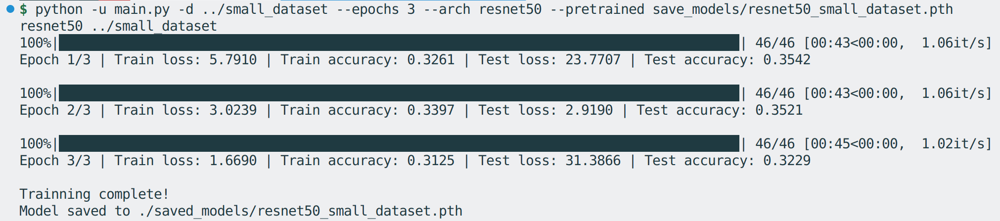
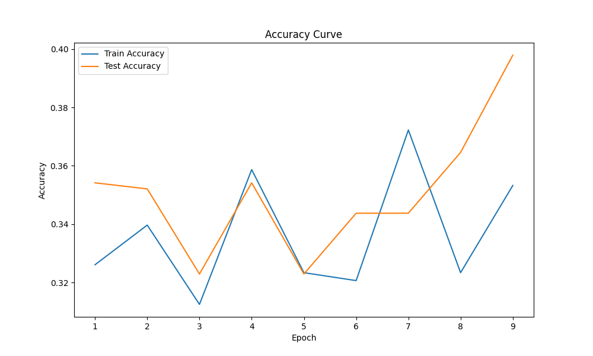

# Dog Breed Classification

A python program that can load a dog breed dataset, applying transfer learning techniques that allow users to load their pretrained model to train a convolutional neural network to classify dog breeds. 

Coming soon: classify dog breeds from user-supplied images.

## Table of Contents
- [Dog Breed Classification](#dog-breed-classification)
  - [Table of Contents](#table-of-contents)
  - [Dataset](#dataset)
  - [Installation](#installation)
  - [Usage](#usage)
    - [Command-line Arguments](#command-line-arguments)
  - [Example](#example)
  - [Demo:](#demo)

## Dataset

The dataset is taken from this [Kaggle's Stanford Dogs Dataset](https://www.kaggle.com/datasets/jessicali9530/stanford-dogs-dataset).

Consisiting of 120 classes of dog breeds, the original dataset is split into 2 folders: train and validation. Each folder contains 120 subfolders, each corresponding to a different dog breed. Each subfolder contains 100-150 images of that specific dog breed.

To make it easier to test, I made three subsets from the original dataset:
- `dog_breed_3`: 3 classes of dog breeds.
- `dog_breed_10`: 10 classes of dog breeds.
- `dog_breed_120`: 120 classes of dog breeds, the full dataset.

## Installation

1. Clone this repository to your local machine.
2. This folder is for the python program only, he `streamlit` folder is for the streamlit app.
3. Install the required dependencies by running:
   
```
pip install -r requirements.txt
```


## Usage

View or modify the available model architectures in `available_models.txt`.

Run the main script to start training the model and generate loss and accuracy curves.


### Command-line Arguments

The following command-line arguments are available:

- `-a`, `--arch`: Model architecture (default: "resnet50").
- `-d`, `--dataset`: Path to the dataset (default: "../dog_breed_3").
- `-w`, `--workers`: Number of workers (default: 4).
- `--train_batch`: Batch size for training (default: 8).
- `--test_batch`: Batch size for testing (default: 8).
- `--epochs`: Number of epochs for training (default: 10).

Additional optional arguments:

- `-p`, `--pretrained`: Path to pre-trained model (default: None).
- `-r`, `--resume`: Resume training from a local checkpoint (default: False).

## Example

To train the model using the default settings, run the following command:

```
python main.py
```

To specify a different model architecture, dataset path, and number of epochs, use the respective arguments:

```
python main.py --arch resnet50 --dataset /path/to/dataset --epochs 20
```

To resume training from a checkpoint, use the `-r` flag:

```
python main.py -r
```

## Demo:

Command-line arguments:



ResNet50 on dog_breed_3 dataset:


