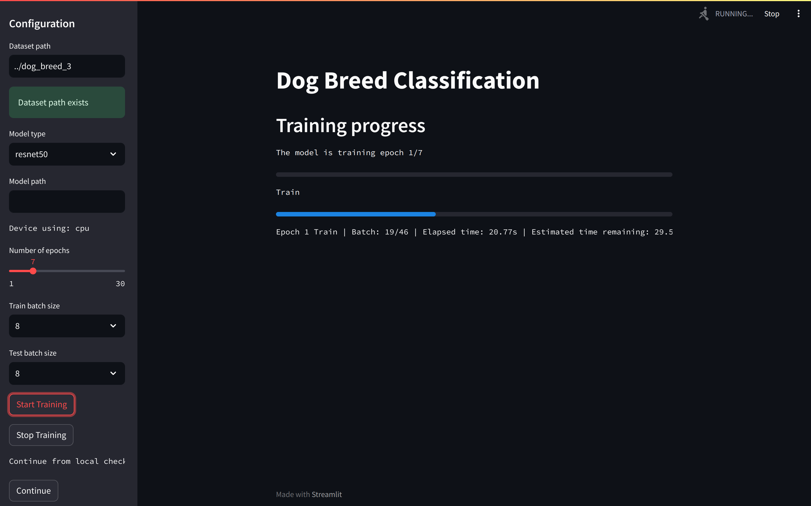

# Dog Breed Classification

A streamlit WebApp that can load a dog breed dataset, applying transfer learning techniques that allow users to load their pretrained model to train a convolutional neural network to classify dog breeds. 

Coming soon: classify dog breeds from user-supplied images.

## Table of Contents
- [Dog Breed Classification](#dog-breed-classification)
  - [Table of Contents](#table-of-contents)
  - [Dataset](#dataset)
  - [Installation](#installation)
  - [Usage](#usage)
  - [Demo:](#demo)

## Dataset

The dataset is taken from this [Kaggle's Stanford Dogs Dataset](https://www.kaggle.com/datasets/jessicali9530/stanford-dogs-dataset).

Consisiting of 120 classes of dog breeds, the original dataset is split into 2 folders: train and validation. Each folder contains 120 subfolders, each corresponding to a different dog breed. Each subfolder contains 100-150 images of that specific dog breed.

To make it easier to test, I made three subsets from the original dataset:
- `dog_breed_3`: 3 classes of dog breeds.
- `dog_breed_10`: 10 classes of dog breeds.
- `dog_breed_120`: 120 classes of dog breeds, the full dataset.

## Installation

1. Clone this repository to your local machine.
2. This folder is for the streamlit app only, the `program` folder is for another program.
3. Install the required dependencies by running:
   
```
pip install -r requirements.txt
```

## Usage

To run the streamlit on the localhost, simply run:

```
streamlit run main.py
```

View or modify the available model architectures in `./models/available_models.txt`.



1. Input dataset path
2. Select model architecture, number of epochs, and batch size.
3. **The training with pretrain model path only works if the model architecture is the same as the pretrain model architecture.**
4. Can stop the training and press continue to resume training, the checkpoint will load from a saved checkpoint in the `./checkpoints` folder.

## Demo:

Training progress:


Plots of loss and accuracy after training:


